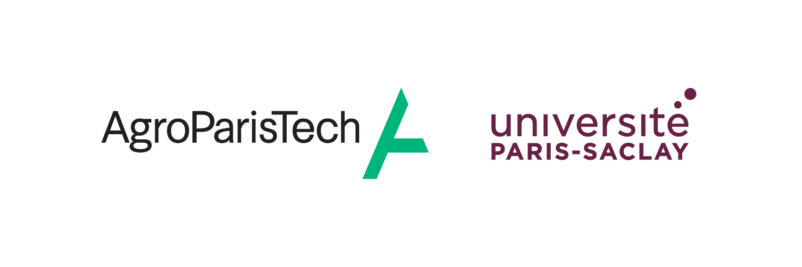

# Projet Ingénieur - IODAA 

Ci joint se trouve le travail de : Adrien Bouchet, Elise Roth, Mélodie Fleury, Vincent Fourmigue et Timothée Sanchez.

Dans le cadre de notre projet ingénieur nous avons pu travailler avec le doctorant **Joseph Allyndrée** pour étudier :

***La détection de dominance sociale à partir de graphes de réseaux dans un élevage bovin laitier***

Ce répertoire contient l'ensemble des approches abordées durant notre travail de 3 mois.

## Module développé pour notre recherche : **TRACE_MODULE**

C'est un module contenant touts les outils qui ont permis l'analyse des données disponibles.

- `preprocessing` : Pré-traitement des données (Seuillage, symétrisation, ...)
- `motif` : bibliothèque custom pour la manipulation de graphes
- `egocentric` : outils pour faire de l'extraction de motifs au sein du dataset
- `apriori_spade` : Application de l'algorithme *Apriori* 
- `DTGC` : Application du Deep temporal graph clustering 
- `descriptive_analysis` : Outils pour l'analyse descriptive des données

## Notebooks

